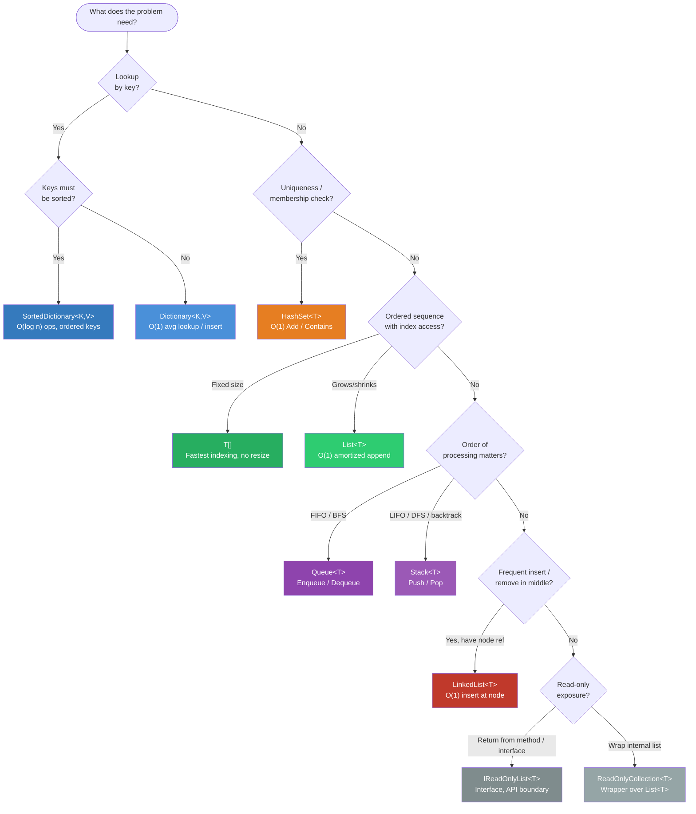

# Collection Selection Guide — Coding Tests

> **How to use this guide:** Read the problem clue, find your scenario, pick the collection. Done.

---

## 1. Visual Flow Diagram



---

## 2. Decision Tree (text fallback — no Mermaid renderer)

```
What is the PRIMARY operation you need?
│
├── Lookup by key (id → value, word → count)?
│   ├── Keys need to be sorted / iterated in order?  →  SortedDictionary<K,V>
│   └── Order does not matter?                       →  Dictionary<K,V>
│
├── Check membership / enforce uniqueness?           →  HashSet<T>
│
├── Ordered sequence + random access by index?
│   ├── Size is fixed?                               →  T[]  (array)
│   └── Size grows / shrinks?                        →  List<T>
│
├── Process items in arrival order (FIFO)?           →  Queue<T>
│
├── Process items in reverse order (LIFO)?           →  Stack<T>
│
├── Frequent insert / remove in the MIDDLE?          →  LinkedList<T>
│
└── Expose data without allowing modification?
    ├── Wrap an existing list?                       →  ReadOnlyCollection<T>
    └── Return from a method / interface?            →  IReadOnlyList<T>
```

---

## 3. Symptom-to-Collection Table

| Problem clue / signal | Best collection | Why |
|---|---|---|
| "find by id", "look up user", "cache results" | `Dictionary<K,V>` | O(1) avg lookup |
| "count frequency", "group by key" | `Dictionary<K,V>` | key → counter |
| "sorted keys", "iterate in order" | `SortedDictionary<K,V>` | BST, O(log n) ops |
| "unique items", "already visited", "no duplicates" | `HashSet<T>` | O(1) membership |
| "intersection / union / difference of sets" | `HashSet<T>` | built-in set ops |
| "ordered list", "append to end", "iterate all" | `List<T>` | O(1) amortized add |
| "fixed size", "matrix", "index-only access" | `T[]` | fastest indexing |
| "BFS", "level order", "process in order received" | `Queue<T>` | FIFO |
| "DFS", "backtracking", "undo / redo", "balanced parentheses" | `Stack<T>` | LIFO |
| "insert at head/tail", "remove from middle (node known)" | `LinkedList<T>` | O(1) insert/remove |
| "return collection safely", "API boundary" | `IReadOnlyList<T>` | no mutation by caller |
| "expose internal list read-only" | `ReadOnlyCollection<T>` | thin wrapper |

---

## 4. Common Problem Patterns → Default Pick

| Problem type | Go-to collection | One-liner reason |
|---|---|---|
| Frequency counting | `Dictionary<T, int>` | key = item, value = count |
| Deduplication | `HashSet<T>` | Add returns false on duplicate |
| Top-K / grouping | `Dictionary` + `List` sort | group first, then order |
| BFS (shortest path, level order) | `Queue<T>` + `HashSet<T>` | queue traversal, set for visited |
| DFS (paths, backtracking) | `Stack<T>` or recursion | LIFO mirrors call stack |
| Sorted output | `List<T>` → `.Sort()` | sort in-place |
| Two-pointer / sliding window | `T[]` or `List<T>` | index arithmetic |
| Graph adjacency | `Dictionary<int, List<int>>` | node → neighbours |
| Cache (LRU-like) | `Dictionary` + `LinkedList<T>` | O(1) lookup + O(1) evict |

---

## 5. Complexity Quick Reference

| Collection | Lookup | Insert (end) | Insert (mid) | Delete | Sorted? |
|---|---|---|---|---|---|
| `T[]` | O(1) | N/A | O(n) | O(n) | No |
| `List<T>` | O(1) | O(1)* | O(n) | O(n) | No |
| `Dictionary<K,V>` | O(1) avg | O(1) avg | — | O(1) avg | No |
| `SortedDictionary<K,V>` | O(log n) | O(log n) | — | O(log n) | Yes |
| `HashSet<T>` | O(1) avg | O(1) avg | — | O(1) avg | No |
| `Queue<T>` | — | O(1) | — | O(1) (Dequeue) | No |
| `Stack<T>` | — | O(1) | — | O(1) (Pop) | No |
| `LinkedList<T>` | O(n) | O(1)† | O(1)† | O(1)† | No |

\* amortized  
† only when you already hold the `LinkedListNode<T>`

---

## 6. Fast Rules (When in Doubt)

- **Default list** → `List<T>`
- **Default map** → `Dictionary<K,V>`
- **Need uniqueness** → `HashSet<T>`
- **Need order traversal** → Queue (forward) / Stack (reverse)
- **Need sorted keys** → `SortedDictionary<K,V>`
- **Read-only return type** → `IReadOnlyList<T>`
- **Avoid** `ArrayList`, `Hashtable` — legacy, non-generic

---

## 7. SortedDictionary vs SortedList

| | `SortedDictionary<K,V>` | `SortedList<K,V>` |
|---|---|---|
| Backed by | Red-Black Tree | Two arrays |
| Insert/Delete | O(log n) | O(n) |
| Memory | Higher | Lower |
| Indexed access | No | Yes (`Values[i]`) |
| **Best when** | Many inserts + lookups | Small, mostly-read dataset |

---

## 8. IReadOnlyList vs ReadOnlyCollection

| | `IReadOnlyList<T>` | `ReadOnlyCollection<T>` |
|---|---|---|
| What it is | Interface | Concrete wrapper class |
| Use at | Method return / parameter | Wrapping an internal `List<T>` |
| Caller can cast away? | Harder (interface) | Yes (`((IList<T>)rc)`) |
| Preferred for | API design | Exposing private list |

---

*Cross-reference: [collections-cheatsheet.md](collections-cheatsheet.md) for detailed API examples and BFS/DFS snippets.*
